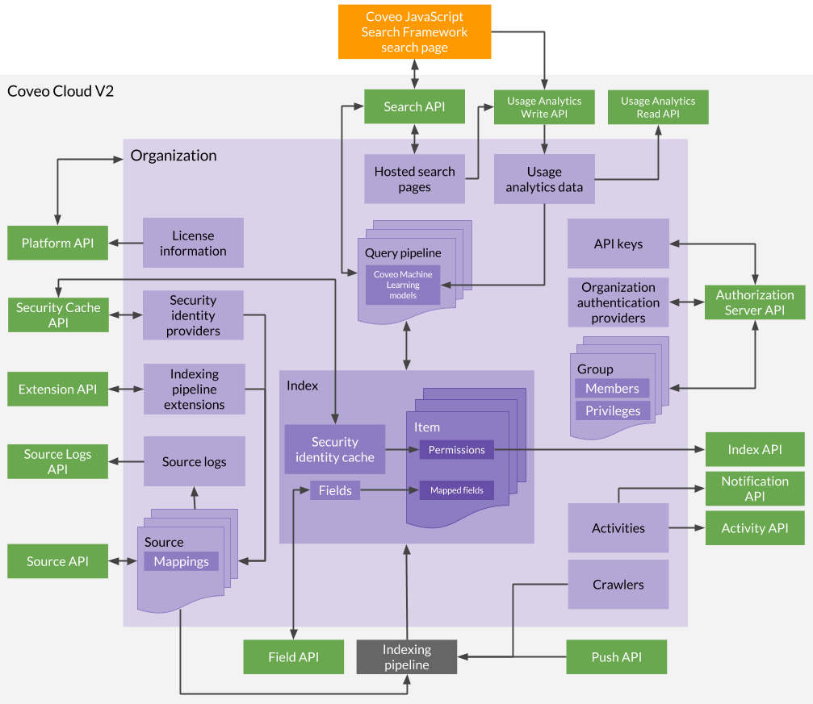

# Coveo Cloud V2 API Overview

The [Coveo Cloud V2 platform](Glossary_37585054.html#Glossary-CoveoCloudV2Platform) is an enterprise-class native cloud SaaS/PaaS solution that provides a unified and secure way to search for contextually relevant content across multiple enterprise systems. The platform relies on [Coveo Cloud usage analytics](Glossary_37585054.html#Glossary-CoveoCloudUsageAnalytics) data to yield [Coveo Machine Learning](Glossary_37585054.html#Glossary-CoveoMachineLearning) powered recommendations. The Coveo Cloud V2 platform embraces the concepts of micro-services and scalability, allowing users to expand their search solution as their business grows.

As such, the Coveo Cloud V2 platform exposes REST APIs which you can use to achieve anything you could do from the [Coveo Cloud V2 Administration Console](http://www.coveo.com/go?dest=cloudhelp&lcid=9&context=302) or from a [Coveo JavaScript Search Framework](https://developers.coveo.com/display/JsSearchV1) page. 

The following diagram provides a visual overview of the main interactions between the REST API services and a [Coveo Cloud V2 organization](Glossary_37585054.html#Glossary-CoveoCloudV2Organization).

## Coveo Cloud V2 REST APIs

<table>
<colgroup>
<col width="33%" />
<col width="33%" />
<col width="33%" />
</colgroup>
<thead>
<tr class="header">
<th>API name</th>
<th>Usage</th>
<th>Reference documentation</th>
</tr>
</thead>
<tbody>
<tr class="odd">
<td>Search</td>
<td><ul>
<li>Perform <a href="Glossary_37585054.html#Glossary-Query">queries</a> on an <a href="Glossary_37585054.html#Glossary-Index">index</a>.</li>
<li>Manage search authentication providers (SharePoint claims and SAML) (see <a href="Claims_Authentication">Claims Authentication</a> and <a href="SAML_Authentication">SAML Authentication</a>).</li>
<li>Create search tokens (see <a href="Search_Token_Authentication">Search Token Authentication</a>).</li>
<li>Manage <a href="Glossary_37585054.html#Glossary-CoveoCloudQueryPipeline">Coveo Cloud query pipelines</a>.</li>
</ul></td>
<td><a href="https://platform.cloud.coveo.com/docs?api=SearchApi">Search API</a></td>
</tr>
<tr class="even">
<td>Usage Analytics Write</td>
<td><ul>
<li>Record <a href="Glossary_37585054.html#Glossary-CoveoCloudUsageAnalytics">Coveo Cloud usage analytics</a> events (click, search, view, or custom events) for a Coveo Cloud V2 organization.</li>
</ul></td>
<td><a href="https://platform.cloud.coveo.com/docs?api=UsageAnalyticsWrite">Usage Analytics Write API</a></td>
</tr>
<tr class="odd">
<td>Usage Analytics Read</td>
<td><ul>
<li>Access the usage analytics data of a Coveo Cloud V2 organization (statistics, reports, dimensions, metrics, etc.).</li>
</ul></td>
<td><a href="https://platform.cloud.coveo.com/docs?api=UsageAnalyticsRead">Usage Analytics Read API</a></td>
</tr>
<tr class="even">
<td>Platform</td>
<td><ul>
<li>Create, update, or delete a Coveo Cloud V2 organization.</li>
<li>Access a Coveo Cloud V2 organization status, login activity, license, and limit information.</li>
</ul></td>
<td><a href="https://platform.cloud.coveo.com/docs?api=Platform">Platform API</a></td>
</tr>
<tr class="odd">
<td>Source</td>
<td><ul>
<li>Manage <a href="Glossary_37585054.html#Glossary-Source">sources</a> and their related field mappings and indexing pipeline extensions.</li>
</ul></td>
<td><a href="https://platform.cloud.coveo.com/docs?api=Source">Source API</a></td>
</tr>
<tr class="even">
<td>Push</td>
<td><ul>
<li><em>Push</em> items, identities, and permissions to a push source (as opposed to <em>pulling</em> content into a standard source using Coveo Cloud crawlers).</li>
</ul></td>
<td><a href="https://platform.cloud.coveo.com/docs?api=PushApi">Push API</a></td>
</tr>
<tr class="odd">
<td>Index</td>
<td><ul>
<li>Access the permission models of indexed items.</li>
</ul></td>
<td><a href="https://platform.cloud.coveo.com/docs?api=Index">Index API</a></td>
</tr>
<tr class="even">
<td>Fields</td>
<td><ul>
<li>Manage fields in an index.</li>
</ul></td>
<td><a href="https://platform.cloud.coveo.com/docs?api=Field">Field API</a></td>
</tr>
<tr class="odd">
<td>Extension</td>
<td><ul>
<li>Manage and test indexing pipeline extensions.</li>
</ul></td>
<td><a href="https://platform.cloud.coveo.com/docs?api=Extension">Extension API</a></td>
</tr>
<tr class="even">
<td>Source Logs</td>
<td><ul>
<li>Access the indexing pipeline logs of a source.</li>
</ul></td>
<td><a href="https://platform.cloud.coveo.com/docs?api=SourceLogsApi">Source Logs API</a></td>
</tr>
<tr class="odd">
<td>Activity</td>
<td><ul>
<li>Access the activity information of a Coveo Cloud V2 organization.</li>
</ul></td>
<td><a href="https://platform.cloud.coveo.com/docs?api=Activity">Activity API</a></td>
</tr>
<tr class="even">
<td>Notification</td>
<td><ul>
<li>Manage and test activity notification subscriptions for a Coveo Cloud V2 organization.</li>
</ul></td>
<td><a href="https://platform.cloud.coveo.com/docs?api=Notification">Notification API</a></td>
</tr>
<tr class="odd">
<td>Authorization Server</td>
<td><ul>
<li>Manage SAML security identity providers for a Coveo Cloud V2 organization.</li>
<li>Manage groups, members, and API keys in a Coveo Cloud V2 organization.</li>
</ul></td>
<td><a href="https://platform.cloud.coveo.com/docs?api=AuthorizationServer">Authorization Server API</a></td>
</tr>
<tr class="even">
<td>Security Cache</td>
<td><ul>
<li>Manage non-SAML security identity providers for a Coveo Cloud V2 organization.</li>
<li>Manage security cache refresh schedules.</li>
</ul></td>
<td><a href="https://platform.cloud.coveo.com/docs?api=SecurityCache">Security Cache API</a></td>
</tr>
</tbody>
</table>

## Generated Swagger UI Documentation Site

You can visualize the API reference documentation and test API calls using the generated Swagger UI Coveo Cloud V2 API reference documentation site (see [Coveo Cloud Platform API](https://platform.cloud.coveo.com/docs)).

## Attachments:

{width="8" height="8"} [Coveo Cloud V2 Platform API Diagram.png](attachments/37584927/37552242.png) (image/png)
{width="8" height="8"} [Coveo Cloud V2 Platform API Diagram.jpg](attachments/37584927/37552241.jpg) (image/jpeg)
{width="8" height="8"} [Coveo Cloud V2 Platform API Diagram.png](attachments/37584927/37552338.png) (image/png)
{width="8" height="8"} [Coveo Cloud V2 Platform API Diagram.png](attachments/37584927/37552362.png) (image/png)
{width="8" height="8"} [Coveo Cloud V2 Platform API Diagram.png](attachments/37584927/37552471.png) (image/png)
{width="8" height="8"} [Coveo Cloud V2 Platform API Diagram.png](attachments/37584927/37552634.png) (image/png)
{width="8" height="8"} [Coveo Cloud V2 Platform API Diagram.png](attachments/37584927/37552186.png) (image/png)

