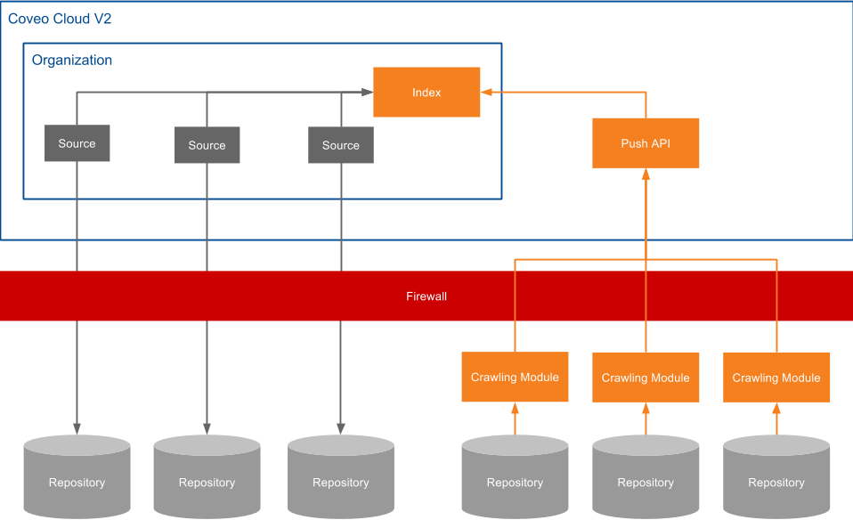

# Coveo Cloud V2 On-Premises Crawling Module

Note:

> The Coveo Cloud V2 Crawling Module is currently in an alpha version and must be deployed with the Coveo Support assistance.

Coveo Cloud V2 comes with a set of sources that can pull content from various cloud and some on-premises repositories to make your content searchable (see Available Coveo Cloud Source Types).

The Crawling Modules are deployed on-premises to securely index your valuable on-premises content (and if applicable permissions) into a Coveo Cloud V2 push type source. Once a Crawling Module is installed on a Windows machine, all communications are outbound on port 443 (HTTPs), preventing having to open inbound ports to your secured infrastructure.

The Crawling Modules pull the data from the on-premises repositories, and then send it the to the Push API (see [Push API Usage Overview](https://developers.coveo.com/x/toQAAg)). 

When you want to index more than one on-premises repository, you must install one Crawling Module module instance for each repository, each with a unique port (behind the firewall).

#### Supported Connector types

Currently, Crawling Modules are only compatible with the following connector types:

-   Confluence
-   Database
-   Files
-   JIRA
-   Jive

Other connectors will be supported shortly.

 

#### What's Next

Review the steps to deploy a Crawling Module (see [Crawling Module Deployment Overview](https://developers.coveo.com/x/7IYkAg)).

## Attachments:

{width="8" height="8"} [CoveoCloudCrawlingModuleSchema.png](attachments/35948254/36176459.png) (image/png)
{width="8" height="8"} [CoveoCloudCrawlingModuleSchema (1).png](attachments/35948254/36176503.png) (image/png)
{width="8" height="8"} [CoveoCloudCrawlingModuleSchema (2).png](attachments/35948254/36176516.png) (image/png)
{width="8" height="8"} [image2016-8-25 9:44:39.png](attachments/35948254/36176457.png) (image/png)
{width="8" height="8"} [image2016-8-25 9:45:59.png](attachments/35948254/36176458.png) (image/png)
{width="8" height="8"} [CoveoCloudCrawlingModuleSchema.png](attachments/35948254/36176518.png) (image/png)
{width="8" height="8"} [CoveoCloudCrawlingModuleSchema (1).png](attachments/35948254/36176455.png) (image/png)
{width="8" height="8"} [CoveoCloudCrawlingModuleSchema (2).png](attachments/35948254/36176456.png) (image/png)
{width="8" height="8"} [CoveoCloudCrawlingModuleSchema.jpg](attachments/35948254/36176517.jpg) (image/jpeg)
{width="8" height="8"} [CoveoCloudCrawlingModuleSchema.png](attachments/35948254/36176454.png) (image/png)
{width="8" height="8"} [CoveoCloudCrawlingModuleSchema (1).jpg](attachments/35948254/36176519.jpg) (image/jpeg)
{width="8" height="8"} [CoveoCloudCrawlingModuleSchema (3).png](attachments/35948254/36176655.png) (image/png)
{width="8" height="8"} [CoveoCloudCrawlingModuleSchema (4).png](attachments/35948254/36176656.png) (image/png)
{width="8" height="8"} [CoveoCloudCrawlingModuleSchema (5).png](attachments/35948254/36176657.png) (image/png)

