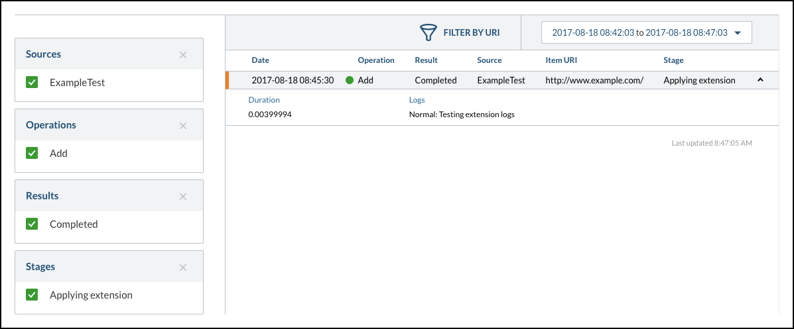

# Logging Messages from an Indexing Pipeline Extension

The following procedure describes how to log messages from an indexing pipeline extension using the Extension API (see [Extension API Reference](https://developers.coveo.com/x/twEvAg)).

1.  Create an extension script (see [Creating an Indexing Pipeline Extension with the API](Creating_an_Indexing_Pipeline_Extension_with_the_API)).
2.  In the extension script, use the `Log` method (see [Log](https://developers.coveo.com/x/OQMvAg#DocumentObjectPythonAPIReference-LogMethodLog)).
3.  Apply the extension to a source (see Applying an Extension to a Source).

4.  Rebuild the source in order to run the extension and impact how the content is indexed.

5.  Once an item is processed and the extension is applied, a log entry can be viewed in the Coveo Cloud V2 Administration Console Log Browser (see Log Browser). Once the source is rebuilt, all log entries are available.

 

Important

> In the log browser, you can see your log message only when expanding a row detailing an `Applying extension` **Stage**. Foremost, your log message will appear only when the `Add` **Operation** **Result** is `Completed`. By design, any other value for **Operation**, **Result** or **Stage** means that there is no log message available.

## Attachments:

{width="8" height="8"} [image2017-8-14 14:28:39.png](attachments/37585540/37552630.png) (image/png)
{width="8" height="8"} [image2017-8-14 14:43:43.png](attachments/37585540/37552631.png) (image/png)
{width="8" height="8"} [image2017-8-16 15:32:49.png](attachments/37585540/37552828.png) (image/png)
{width="8" height="8"} [image2017-8-16 15:33:6.png](attachments/37585540/37552829.png) (image/png)
{width="8" height="8"} [image2017-8-16 15:36:42.png](attachments/37585540/37552830.png) (image/png)
{width="8" height="8"} [image2017-8-18 8:49:52.png](attachments/37585540/37552862.png) (image/png)

